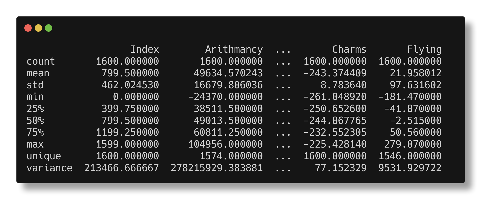
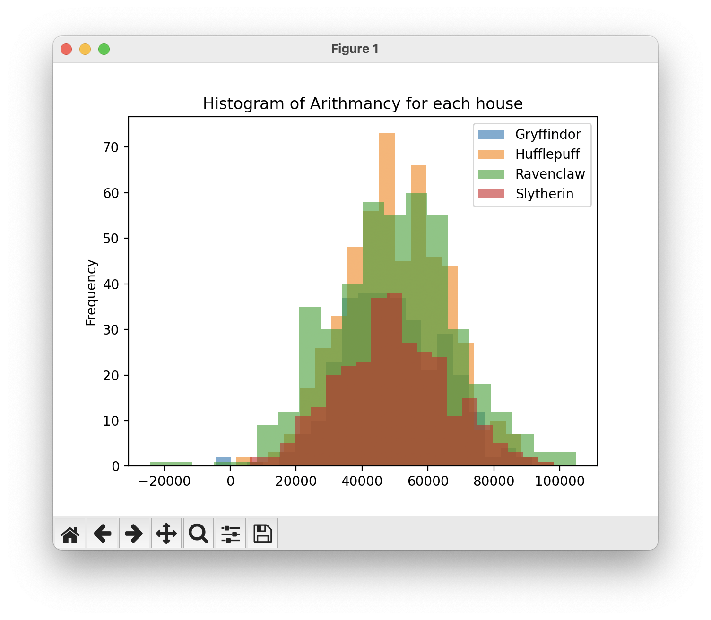
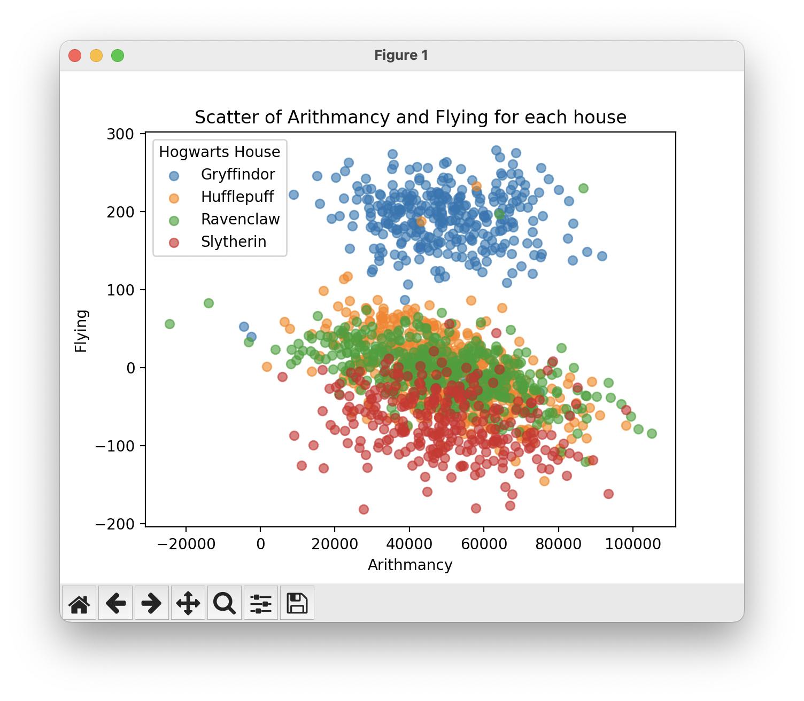
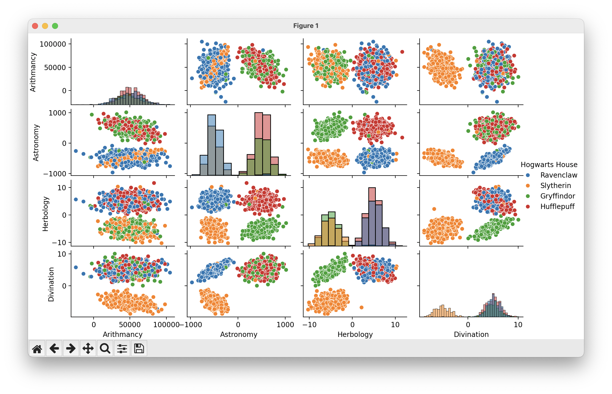

# Data Exploration Guide

Welcome to the Data Exploration Guide for the DSLR project. This guide will help you understand the various ways you can explore and visualize your dataset using the provided scripts.


## Table of Contents

- [Introduction](#introduction)
- [Describing the Dataset](#describing-the-dataset)
- [Histogram](#histogram)
- [Scatter Plot](#scatter-plot)
- [Pair Plot](#pair-plot)


## Introduction

Data exploration is a crucial step in any data science project. It helps you understand the structure, distribution, and relationships within your data. In this project, we provide several scripts to facilitate data exploration:

1. `describe.py` - Provides a statistical summary of the dataset.
2. `histogram.py` - Plots histograms for the specified course.
3. `scatter_plot.py` - Creates scatter plots to visualize relationships between two courses.
4. `pair_plot.py` - Generates pair plots for multiple courses to examine their pairwise relationships.


## Describing the Dataset

The `describe.py` script generates a statistical summary of the dataset, including measures such as mean, standard deviation, minimum, and maximum values.

#### Usage

```bash
python describe.py [dataset]
```

#### Example

```bash
python describe.py datasets/dataset_train.csv
```

This will output a summary of the dataset, helping you to quickly grasp the key statistics of each feature.



## Histogram

The histogram.py script plots a histogram for a specified course, allowing you to see the distribution of values for that course.

#### Usage

```bash
python histogram.py [dataset] [course]
```

#### Example

```bash
python histogram.py datasets/dataset_train.csv Arithmancy
```

This command will generate a histogram of the "Arithmancy" course, showing the frequency of different score ranges.



## Scatter Plot
The scatter_plot.py script creates a scatter plot to visualize the relationship between two courses.

#### Usage
```bash
python scatter_plot.py [dataset] [course1] [course2]
```

#### Example
```bash
python scatter_plot.py datasets/dataset_train.csv Arithmancy Flying
```

This will produce a scatter plot with "Arithmancy" scores on the x-axis and "Flying" scores on the y-axis, illustrating any potential correlation between the two courses.



## Pair Plot
The pair_plot.py script generates pair plots for multiple courses, allowing you to examine the pairwise relationships between several courses in a single visualization.

#### Usage
```bash
python pair_plot.py [dataset] [course1] [course2] [course3] [course4]
```

#### Example
```bash
python pair_plot.py datasets/dataset_train.csv Arithmancy Astronomy Herbology Divination
```

This command will create a matrix of scatter plots for the specified courses, enabling you to compare each pair of courses visually.



## Conclusion
By using these scripts, you can perform comprehensive data exploration, gaining insights into the structure and relationships within your dataset. This foundational understanding is essential before moving on to data cleaning and model training.
